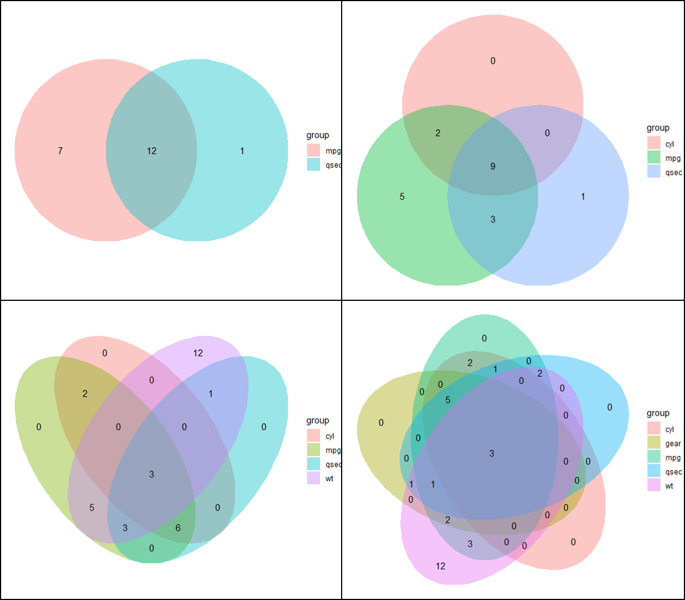

# ggeuler

An [R](https://www.r-project.org) package that draws modifiable venn diagrams in [ggplot2](https://ggplot2.tidyverse.org/). The venn diagrams can easily be modified and added to an existing ggplot object. ggeuler uses base R functions to convert the data into a format that is than vizualized using ggplot2's geom_polygon layer.

# Installation
Install the package from the git repository:
``` r
devtools::install_github("solatar/ggeuler")
```

# Create a venn diagram
Load the package, create your venn diagrams. ggeuler can create venn diagrams with up to 5 sets. A theme_void normally goes will with venn diagrams.
``` r
library(ggeuler)
library(ggplot2)

#to showcase ggeuler, let's create a test set list. It is simply a list of vectors.
set1 <- rownames(subset(mtcars, mpg>18))
set2 <- rownames(subset(mtcars, qsec>18))
set3 <- rownames(subset(mtcars, cyl<5))
set4 <- rownames(subset(mtcars, wt>2.5))
set5 <- rownames(subset(mtcars, gear==4))
carset <- list(mpg=set1, qsec=set2, cyl=set3, wt=set4, gear=set5)

ggplot2::ggplot() + geom_euler(carset) +
  theme_void()
```


You can change all the usual ggplot parameters and add additional layers. You can also change the position of the venn diagram with the xlim and ylim arguements.
Note, that by default, geom_euler will force the graph to be a square. If you don't want that, specify fixedCoords=FALSE.
